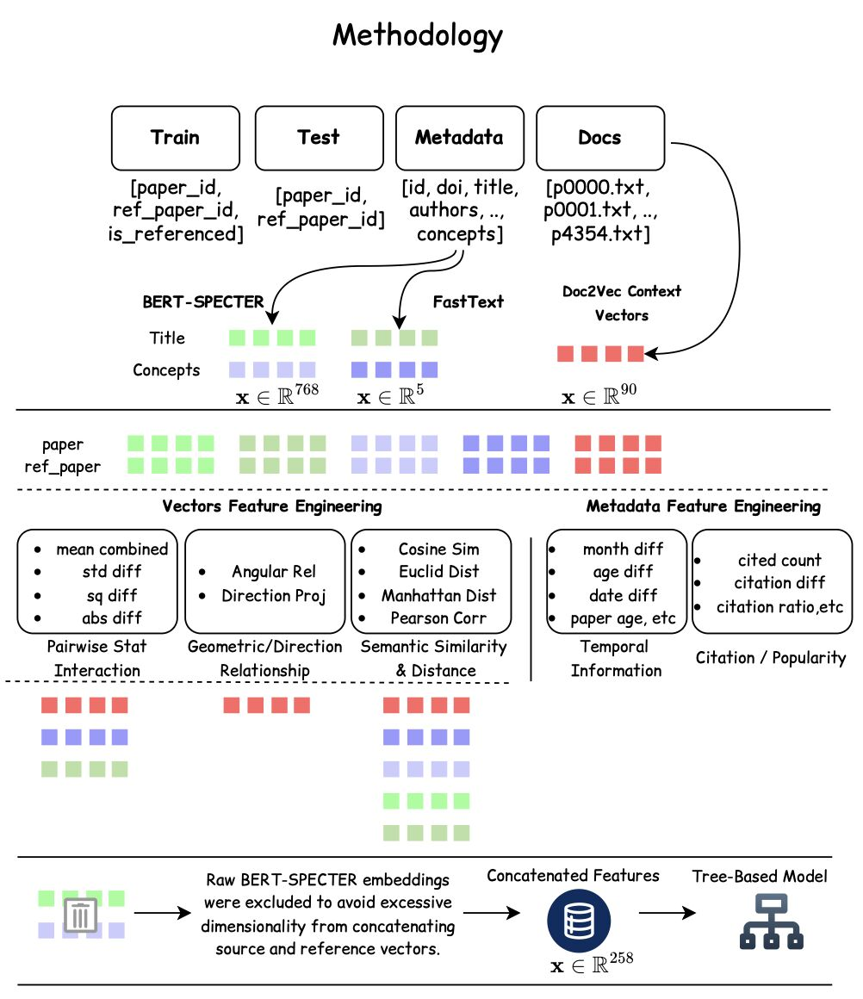
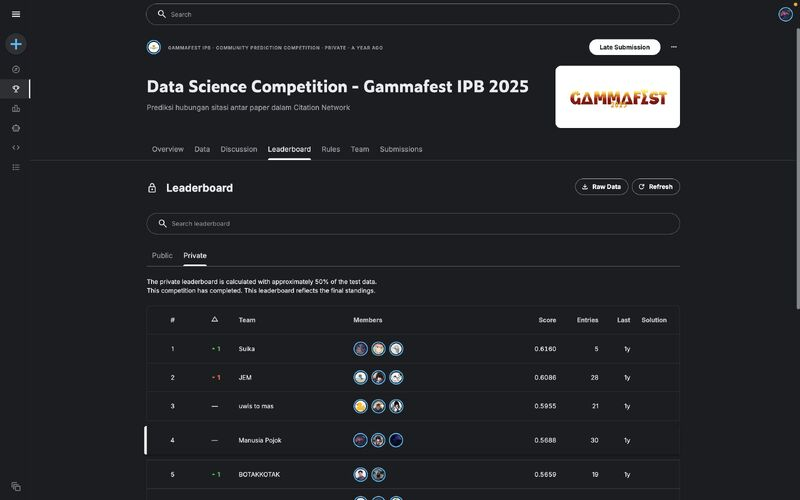

# Manusia Pojok

**Finalist — GammaFest Data Science Competition 2025, Institut Pertanian Bogor (IPB)**

Manusia Pojok is a machine-learning approach for predicting whether one scientific paper references another. The project turns pairs of papers into semantic, vector, temporal, citation, and metadata features, then performs binary classification with CatBoost.

> The final private leaderboard placed **Manusia Pojok 4th** with an MCC of **0.5688**. The accompanying report rounds its best result to 0.568. These are reported competition results, not a fresh reproduction from the files in this repository.

[Read the project story and retrospective on LinkedIn](https://www.linkedin.com/posts/raffyzeidan_this-post-is-mainly-here-as-a-reference-for-ugcPost-7496932806653194241-q6xp/)

## Problem

Finding relevant academic references is difficult when a literature collection becomes large. The GammaFest task framed this as imbalanced binary classification: given a source paper and a candidate reference paper, predict whether a citation relationship exists. Submissions were evaluated with MCC.

## Approach

<p align="center">
  
</p>

<p align="center"><em>Original problem-solving architecture shared in the project’s LinkedIn retrospective.</em></p>

The original deep-learning-heavy direction was constrained by GPU memory and a roughly ten-day competition window. The final solution instead combined:

- **Doc2Vec** embeddings for full paper text, selected as a computationally efficient representation for long documents.
- **FastText** and **AllenAI SPECTER** embeddings for titles and concepts.
- Pairwise cosine, Euclidean, Manhattan, correlation, angular, projection, difference, and aggregate vector features.
- Temporal, citation, and other metadata-derived features.
- Random oversampling followed by a GPU-trained **CatBoost** classifier.
- Threshold selection using validation MCC.

The report compares several iterations. Its strongest listed configuration combines Doc2Vec, FastText, SPECTER, engineered metadata, and pairwise embedding features with tuned CatBoost.

## Repository contents

| File | Description |
| --- | --- |
| [`main.ipynb`](main.ipynb) | Original Kaggle competition notebook and modeling pipeline. |
| [`DSC25125_Manusia Pojok_Laporan.pdf`](DSC25125_Manusia%20Pojok_Laporan.pdf) | Six-page technical report in Indonesian. |
| [`DSC25125_Manusia Pojok_Presentasi.pdf`](DSC25125_Manusia%20Pojok_Presentasi.pdf) | Competition presentation deck. |
| [`FINALIS - Mohammad Raffy Zeidan.pdf`](FINALIS%20-%20Mohammad%20Raffy%20Zeidan.pdf) | Finalist certificate. |
| [`PESERTA - Mohammad Raffy Zeidan.pdf`](PESERTA%20-%20Mohammad%20Raffy%20Zeidan.pdf) | Participant certificate. |

## Running the notebook

The notebook was developed for Kaggle and expects the private competition dataset at:

```text
/kaggle/input/gammax/
├── train.csv
├── test.csv
├── papers_metadata.csv
└── Paper Database/
    └── Paper Database/
```

To reproduce it:

1. Create a Kaggle notebook with the competition data mounted as `gammax`.
2. Select a GPU accelerator; the final CatBoost configuration uses `task_type="GPU"`.
3. Install the dependencies from `requirements.txt` if they are not already available.
4. Run `main.ipynb` from top to bottom.

The notebook downloads the `allenai/specter` checkpoint and NLTK resources at runtime. Exact reproducibility also depends on access to the original GammaFest data, which is not redistributed here.

## Reported model progression

| Configuration | Reported MCC |
| --- | ---: |
| CatBoost + raw TF-IDF document/metadata features | 0.320 |
| Tuned LightGBM + TF-IDF/cosine document features | 0.410 |
| Tuned Random Forest + TF-IDF/cosine document features | 0.470 |
| CatBoost + Doc2Vec document features | 0.500 |
| CatBoost + Doc2Vec + FastText + engineered metadata | 0.520 |
| CatBoost + Doc2Vec + FastText + SPECTER + engineered pairwise features | 0.540 |
| Tuned CatBoost with the full feature set | **0.568** |

These numbers are transcribed from the submitted report and should be interpreted within the original competition split and evaluation setup.

<p align="center">
  
</p>

<p align="center"><em>Final private leaderboard shown in the LinkedIn post: 4th place, MCC 0.5688.</em></p>

## Team

- Bryant Farrel
- Mohammad Raffy Zeidan
- Evans Kizito

## Limitations and future work

- The competition dataset is not included, so the notebook is not self-contained.
- The pipeline was produced under strict time and compute constraints and contains exploratory notebook code rather than a packaged training application.
- Validation threshold selection and oversampling should be revisited with a rigorous cross-validation protocol before production use.
- The SPECTER representation and pair construction deserve further experimentation.
- Citation graphs naturally motivate graph-based models such as GNNs, which were outside the competition-time implementation.

## Acknowledgements

Developed for the **GammaFest Data Science Competition 2025** organized by Institut Pertanian Bogor (IPB). The original project files were migrated from the author's consolidated competition repository while preserving their Git history.
